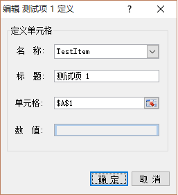

# ExcelDna-XlDialog
Wrapper xlfDialogBox C# Class

关于 XlfDialog 方法文档里吗介绍的很少，属于很早以前就存在的功能，属于Excel Macro 4 的功能。
在 Excel-DNA 中有这个方法的定义，XlCall.xlfDialog
参数为一个 N*7的二维数组，来定义对话框的内容。

##Example



##Code
```C#
new XlDialog(){ Width = 337,Height = 255,Text = "TestDialog"};
var okBtn = new OkButton() { X = 169, Y = 220, Width = 75, Height = 23, Text = "确 定" };
var cancelBtn = new CancelButton() { X = 250, Y = 220, Width = 75, Height = 23, Text = "取 消" };
var groupBox = new GroupBox() { X = 12, Y = 12, Width = 312, Height = 183, Text = "定义单元格" };
var valueEdit = new TextBox() { X = 101, Y = 153, Width = 202, Value = "" };
var labelForValue = new Label("数  值:") { X = 27, Y = 156, Width = 68, };
var addressEdit = new ReferenceEdit() { X = 101, Y = 114, Width = 202};
var labelForAddress = new Label("单元格:") { X = 27, Y = 117, Width = 68, };
var captionEdit = new TextBox() { X = 101, Y = 75, Width = 202 };
var labelForCaption = new Label("标  题:") { X = 29, Y = 78, Width = 68, };
var nameEdit = new DropdownList() { X = 101, Y = 37, Width = 202 };
nameEdit.Items.AddRange(new string[]{"Item 1","Item 2","Item 3"})
var labelForNames = new Label("名  称:") { X = 29, Y = 40, Width = 66, };

dialog.Controls.Add(okBtn);
dialog.Controls.Add(cancelBtn);
dialog.Controls.Add(groupBox);
dialog.Controls.Add(valueEdit);
dialog.Controls.Add(labelForValue);
dialog.Controls.Add(addressEdit);
dialog.Controls.Add(labelForAddress);
dialog.Controls.Add(captionEdit);
dialog.Controls.Add(labelForCaption);
dialog.Controls.Add(nameEdit);
dialog.Controls.Add(labelForNames);

dialog.ShowDialog();
```

##Description
TextBox/Label 等控件的高度是不需要指定的，Value 属性是对话框返回的值。
对话框大小默认为 300x200.
ComboBox/DropdownList 必须指定 Items，作为列表项。
在 XlDialog.ShowDialog() 方法调用之前可以修改各个属性，对话框显示时根据控件定义自动构造内部的 *dialog_ref* 数组。

*Picture button 和 Icons 还没有实现，不知道如何处理图片资源。*


>Macro Sheets Only
###Displays the dialog box described in a dialog box definition table.
##Syntax
DIALOG.BOX(dialog_ref)
- *Dialog_ref*    is a reference to a dialog box definition table on sheet, or an array containing the definition table.
>
 If an OK button in the dialog box is chosen, DIALOG.BOX enters values in fields as specified in the dialog_ref area and returns the position number of the button chosen. The position numbers start with 1 in the second row of the dialog box definition table.
 If the Cancel button in the dialog box is chosen, DIALOG.BOX returns FALSE.
>
The dialog box definition table must be at least seven columns wide and two rows high. The definitions of each column in a dialog box definition table are listed in the following table.
>
|Column type	    | Column number |
|:------------------|--------------:|
| Item number	    |              1|
| Horizontal position |            2|
| Vertical position |              3|
| Item width	    |              4|
| Item height	    |              5|
| Text	            |              6|
| Initial value or result |	       7|

>The first row of dialog_ref defines the position, size, and name of the dialog box. It can also specify the default selected item and the reference for the Help button. The position is specified in columns 2 and 3, the size in columns 4 and 5, and the name in column 6. To specify a default item, place the item's position number in column 7. You can place the reference for the Help button in row 1, column 1 of the table, but the preferred location is column 7 in the row where the Help button is defined. Row 1, column 1 is usually left blank.
The following table lists the numbers for the items you can display in a dialog box.
>
|Dialog-box item   |Item number |
|:-----------------|-----------:|
|Default OK button |           1|
| Cancel button |	           2|
| OK button |	               3|
| Default Cancel button |      4|
| Static text |	               5|
| Text edit box |              6|
| Integer edit box |           7|
| Number edit box |            8|
| Formula edit box |           9|
| Reference edit box |         10|
| Option button group |        11|
| Option button |              12|
| Check box |                  13|
| Group box |                  14|
| List box |	               15|
| Linked list box |	           16|
| Icons |                      17|
| Linked file list box (Microsoft Excel for Windows only) |18|
| Linked drive and directory box (Microsoft Excel for Windows only) |19|
| Directory text box |	       20|
| Drop-down list box |         21|
| Drop-down combination edit/list box |22|
| Picture button |	           23|
| Help button |	               24|
>
###Remarks

>Add 100 to an item number in the above table to define the item as a trigger. A trigger is a dialog box item that, when chosen, returns to your macro (as choosing OK would) but continues to display the dialog box, allowing your macro to change the dialog box definition or display an alert message >or another dialog box. The Help button, edit boxes, group boxes, static text, and icons cannot be triggers.
>
Add 200 to an item number to define it as dimmed. A dimmed (gray) item cannot be chosen or selected. For example, 203 is a dimmed OK button. You can use item 223 to include a picture in your dialog box that does not behave like a button.
>
If a trigger has been chosen and you still want to clear a dynamic dialog box from the screen, use DIALOG.BOX(FALSE). This is useful if you want to confirm that the dialog box has been filled out correctly before dismissing it.

>The dialog box definition table can be an array. If dialog_ref is an array instead of a reference, DIALOG.BOX returns a modified copy of that array, along with the results of the dialog box in the seventh column. (The first item in the seventh column is the position number of the chosen button or >of a triggered item.) This is useful if you want to preserve the original dialog box definition table since DIALOG.BOX does not modify the original array argument. If you cancel the dialog box, or if a dialog box error occurs, DIALOG.BOX returns FALSE instead of an array.
